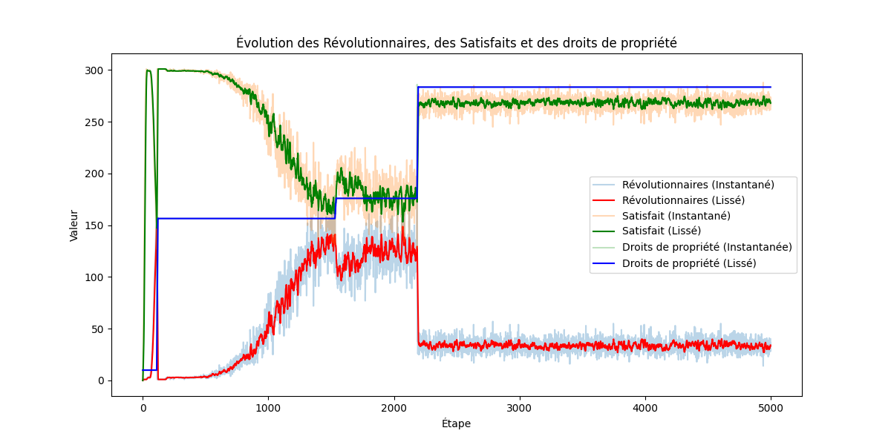

# Institutional Evolution Model

## Overview

This repository hosts a Python-based Agent-Based Model (ABM) designed to explore the relationship between cultural context and institutional change. The model simulates how knowledge dissemination among different societal classes can drive the transition from extractive to inclusive institutions. By coupling ABM with network analysis, the model provides insights into the mechanisms of revolution and the issuance of property rights.

## Key Concepts

### Theoretical Framework
The model is grounded in the hypothesis that for an institution to evolve from an extractive to an inclusive framework, a conducive cultural context is necessary. This context is characterized by the emergence of individual self-interest and a shift away from subordination to a collective whole.

### Agent Classes
The model defines four categories of agents:
- **Innovators**: Representing a small fraction of the bourgeoisie, these agents have high knowledge and influence. They drive awareness of self-interest among other agents.
- **Nobles**: Opposed to change, these agents have similar knowledge levels to Innovators but exert greater influence. They represent a conservative force within the society.
- **Bourgeois**: Influenced by both Innovators and Nobles, these agents have moderate knowledge and influence.
- **People**: The majority of the population with minimal knowledge and influence, representing the general populace.

### Institutional Role
The institution, represented as an agent, is central to the network and interacts with all other agents. It starts in an extractive state, where property rights are concentrated among the Nobles. The institution's evolution towards inclusivity depends on the revolutionary activity within the society.

## Model Dynamics

### Interaction and Influence
Agents interact through a network, where the exchange of knowledge can lead to shifts in satisfaction and revolutionary tendencies. The model calculates influence based on these interactions, with a particular focus on how Innovators spread knowledge and how this affects the likelihood of revolution.

### Revolution and Property Rights
The model incorporates thresholds for revolution and satisfaction for each agent, influenced by knowledge levels and the distribution of property rights. When the number of revolutionaries surpasses a certain threshold, the institution may respond by issuing property rights, simulating a shift towards inclusivity.

### Simulation Details
- **Iterations**: The model runs for 5000 iterations, simulating the long-term evolution of the society.
- **Computation**: The simulation is optimized for performance, running in under 5 minutes on a typical modern laptop.

## Results

### Key Findings
- The model successfully demonstrates the role of knowledge dissemination in triggering institutional change.
- Revolution dynamics are sensitive to the balance between Innovators and Nobles, with property rights issuance acting as a critical response mechanism by the institution.

### Visualizations
The repository includes visual representations of the network, showcasing agent interactions, influence distribution, and the evolution of revolutionary activity.

### Graphical Representation
The following graph illustrates the evolution of the revolutionary agents and satisfaction, alongside the evolution of property rights. This visualization supports our hypothesis that the evolution of institutions is significantly influenced by the cultural context:

## Usage

### Requirements
- Python 3.x
- Mesa library

### Running the Model
Clone the repository and run the simulation using the provided Python scripts.

### Citation
If you use this model or code in your research or project, please cite it by referencing the following:
- **Name**: Octavien Maury
- **Email**: Octavien.Maury@etu.univ-paris1.fr

## Conclusion

This model provides a computational approach to understanding the cultural drivers of institutional change. By simulating the interactions between different societal agents, the model offers valuable insights into the dynamics of revolution and the evolution of inclusive institutions.
